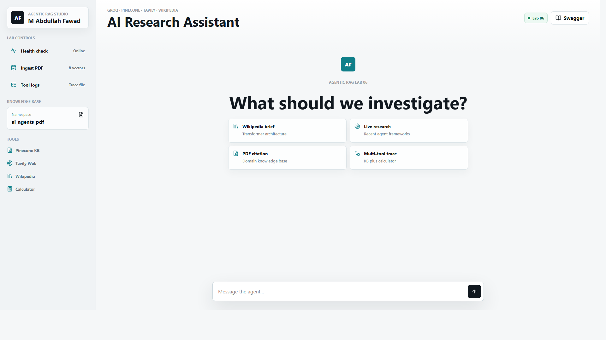

# Agentic RAG Lab 06

Production-style integrated submission for Lab 06: a FastAPI backend, Groq tool-calling agent, Pinecone knowledge base, Tavily live web search, Wikipedia summary tool, safe calculator, and a polished browser chat UI.

Built for **M Abdullah Fawad**.



## Features

- Four registered tools: `search_knowledge_base`, `search_web`, `calculate`, and `get_wikipedia_summary`.
- `/query` returns the answer, ordered tools used, tool trace, and PDF citations.
- `/ingest` chunks `data/ai_agents.pdf`, embeds it with `BAAI/bge-small-en-v1.5`, and upserts vectors to Pinecone namespace `ai_agents_pdf`.
- Image-only PDFs are supported through an OCR/text sidecar fallback. This repo includes `data/ai_agents_ocr.txt` because the supplied `ai_agents.pdf` does not expose extractable text to Python PDF parsers.
- `tool_log.txt` is generated at runtime with timestamped tool calls for graded Task 2.
- Modern chat UI at `/` with health, ingest, logs, demo prompts, citations, and expandable tool traces.
- Swagger/OpenAPI docs at `/docs`.

## Setup

Install Python 3.10+ first. In this terminal, Python was not available on PATH, so install Python or enable the Python launcher before running the app.

```powershell
python -m venv venv
venv\Scripts\Activate.ps1
pip install -r requirements.txt
Copy-Item .env.example .env
```

Fill `.env` with your Groq, Pinecone, and Tavily keys. Do not commit `.env`.

Then run:

```powershell
uvicorn main:app --reload --port 8000
```

Open:

- Chat UI: `http://127.0.0.1:8000`
- API docs: `http://127.0.0.1:8000/docs`
- Tool list: `http://127.0.0.1:8000/tools`
- Health check: `http://127.0.0.1:8000/health`

## Demo Flow

1. Start the server.
2. Open the chat UI and click **Health**.
3. Click **Ingest** to ingest `data/ai_agents.pdf` into Pinecone.
4. Run the demo prompts from the left panel.
5. Click **Logs** after at least five tool-using queries to show `tool_log.txt` entries.

## Graded Task Evidence

Use the folders under `graded_tasks/` for screenshots and submission notes:

- `task_1_wikipedia_tool`: screenshot `/tools` and a Wikipedia query trace.
- `task_2_tool_logging`: screenshot the logs panel or `tool_log.txt` after five queries.
- `task_3_domain_kb_reflection`: screenshots of five domain questions and the research reflection.

## API Shape

`POST /query`

```json
{
  "question": "Give me a Wikipedia summary of the Transformer architecture in NLP."
}
```

Response:

```json
{
  "answer": "...",
  "tools_used": ["get_wikipedia_summary"],
  "tool_trace": [
    {
      "tool": "get_wikipedia_summary",
      "input": { "topic": "Transformer architecture" },
      "output_preview": "..."
    }
  ],
  "citations": []
}
```

## Notes

- The app uses Groq local tool calling instead of exposing hidden chain-of-thought. The visible trace shows tool name, input, and observation preview, which is what the lab screenshots need.
- Pinecone index dimension must match `BAAI/bge-small-en-v1.5` embeddings: `384`.
- If you change the embedding model, re-ingest the PDF into a matching Pinecone index.
